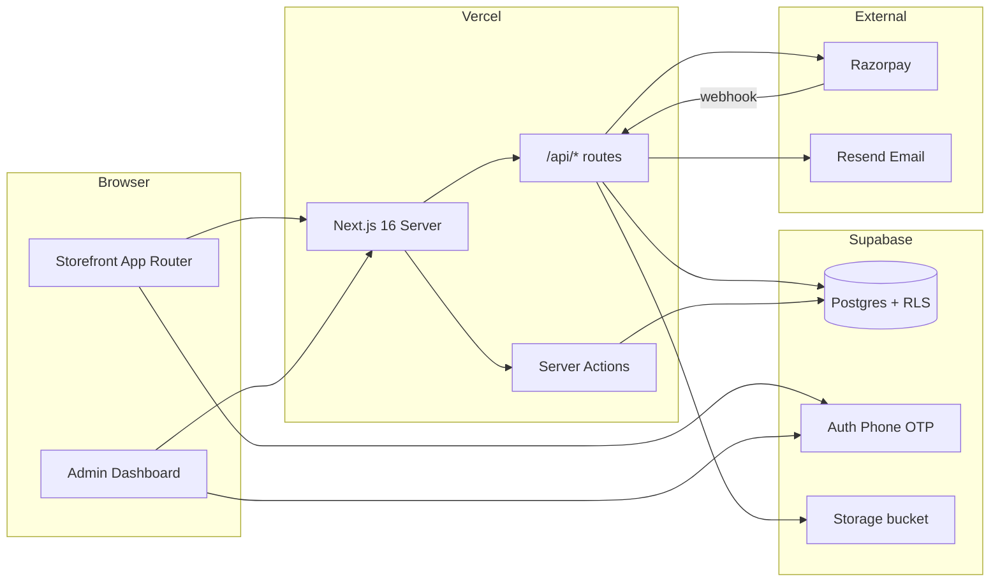
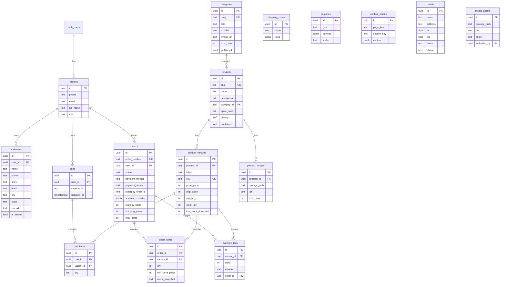
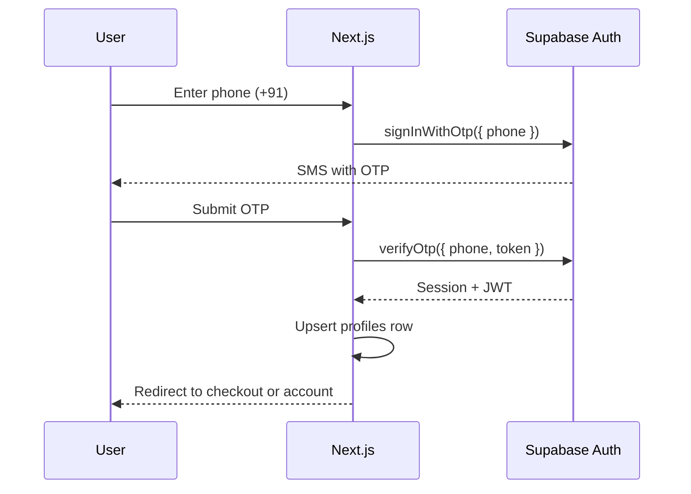
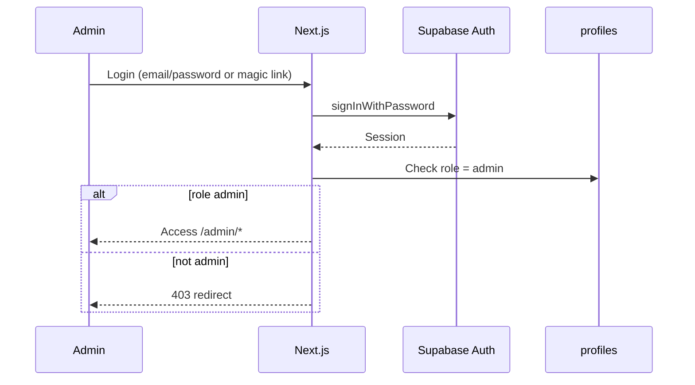
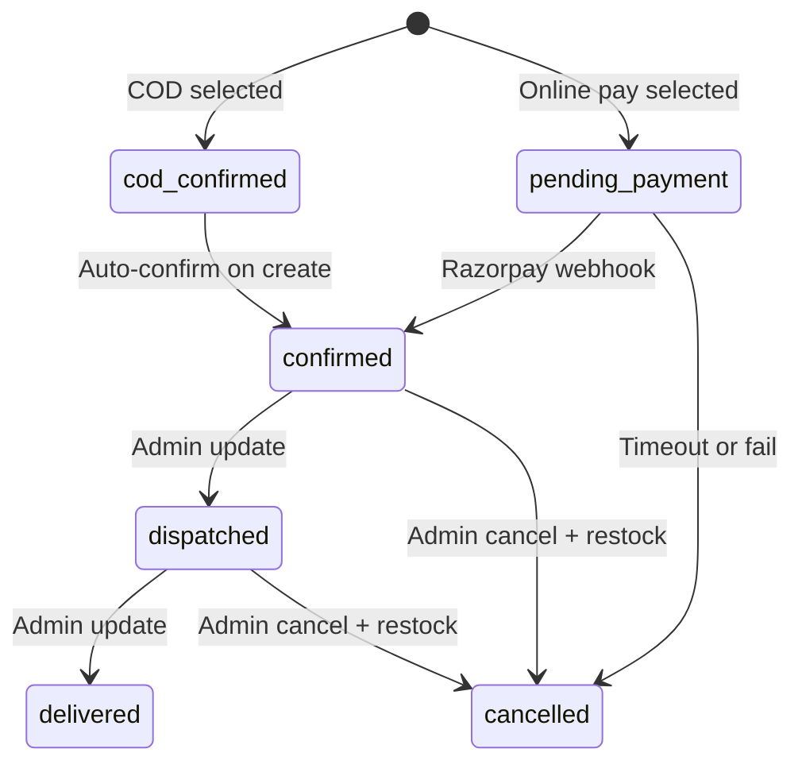
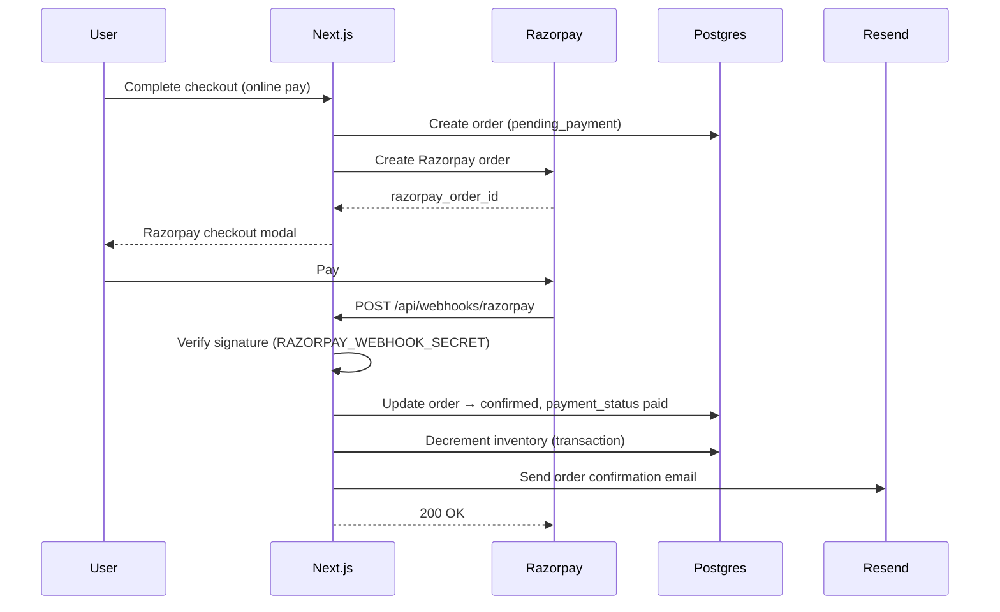
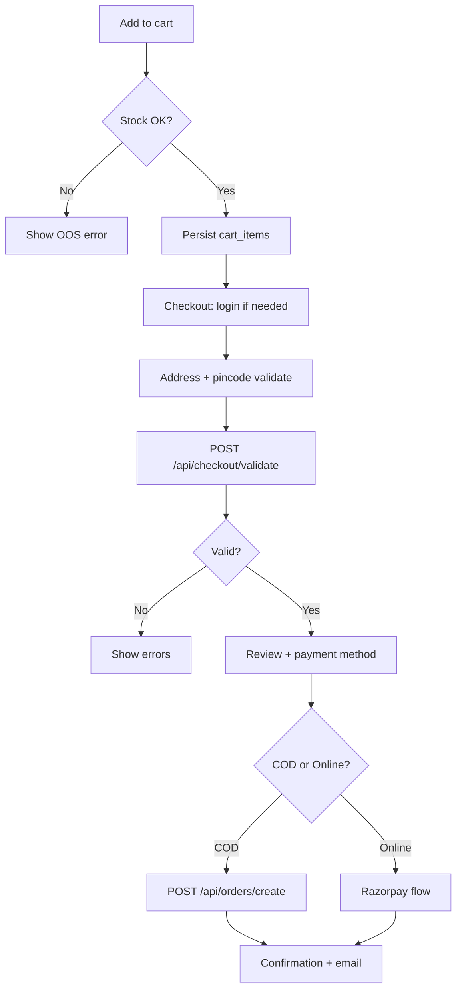

# Jai Jinendra — Architecture

Technical architecture for the production e-commerce platform. Next.js 16 is the single app server; Supabase is the system of record.

---

## System overview



**Principle:** No separate Express/backend server. All business logic in Next.js API routes, Server Actions, and Supabase RLS.

---

## Database schema (ERD)



---

## Row-level security

| Role | Access |
|------|--------|
| **Anonymous** | Read published categories, products, variants (where product published) |
| **Customer** | CRUD own cart, addresses, orders; read own profile |
| **Admin** | Full access when `profiles.role = 'admin'` |

Service role key is server-only (API routes, webhooks, admin batch jobs). Never expose to client.

---

## API routes

All routes under `src/app/api/`. Auth via Supabase session cookie or Bearer token.

| Method | Route | Purpose | Auth |
|--------|-------|---------|------|
| POST | `/api/auth/otp` | Send phone OTP | Public |
| GET | `/api/cart` | Fetch cart + stock validation | Session |
| POST | `/api/cart` | Add / update / remove items | Session |
| POST | `/api/checkout/validate` | Pincode, inventory, totals | Session |
| POST | `/api/orders/create` | Create order (COD or Razorpay pending) | Session |
| POST | `/api/payments/razorpay/create-order` | Create Razorpay order | Session |
| POST | `/api/webhooks/razorpay` | Payment confirmation | Razorpay signature |
| GET | `/api/orders/[id]` | Order detail | Session (owner or admin) |
| GET | `/api/orders/track` | Track by order_number + phone | Public (limited fields) |
| POST | `/api/enquiries` | Corporate + newsletter | Public |
| GET/POST/PATCH/DELETE | `/api/admin/*` | Admin CRUD | Admin role |

**Server Actions** (alternative for admin forms): products, content blocks, outlets — colocated in `src/app/admin/**/actions.ts`.

---

## Auth flows

### Customer — phone OTP



**Rules:**
- Account required before payment step in checkout
- Email collected at checkout, stored on profile + order snapshot
- Session in HTTP-only cookie via `@supabase/ssr`

### Admin



**Middleware:** `src/middleware.ts` validates Supabase session + admin role for `/admin/*` (except `/admin/login`).

---

## Order state machine



| Status | Description |
|--------|-------------|
| `pending_payment` | Razorpay order created; awaiting payment |
| `cod_confirmed` | COD order placed; payment on delivery |
| `confirmed` | Paid or COD accepted; inventory decremented |
| `dispatched` | Shipped |
| `delivered` | Completed |
| `cancelled` | Cancelled; inventory restocked |

**Inventory:** Decrement `product_variants.stock_qty` on transition to `confirmed`. Restock on `cancelled`. Use Postgres transaction with row lock to prevent race conditions.

---

## Razorpay webhook sequence



**COD path:** Skip Razorpay; create order with `cod_confirmed` → auto `confirmed`; send email; decrement inventory.

---

## Cart & checkout flow



---

## Shipping rules (v1)

Stored in `shipping_zones.rules` JSON:

```json
{
  "type": "pan_india_flat",
  "flat_rate_paise": 7900,
  "free_threshold_paise": 99900
}
```

Pincode validation: India Post API or static pincode table v1.

---

## Email (Resend)

| Trigger | Template |
|---------|----------|
| Order confirmed | Order summary, order number, tracking link |
| Order dispatched | Tracking info (when available) |
| (Future) Order cancelled | Refund / restock notice |

From address: `EMAIL_FROM` env var (default `orders@jaijinendra.com`).

---

## File structure (to create)

```
src/lib/supabase/
  client.ts          # Browser client
  server.ts          # Server client (cookies)
  middleware.ts      # Session refresh helper

src/lib/cart/
  index.ts           # Cart operations

src/lib/orders/
  index.ts           # Order creation, status updates

src/lib/payments/
  razorpay.ts        # Order create, signature verify

src/types/
  database.ts        # Generated Supabase types
  cart.ts            # Cart DTOs
  order.ts           # Order DTOs
```

---

## Environment variables

See [`.env.example`](../.env.example). Required for production:

- `NEXT_PUBLIC_SUPABASE_URL`, `NEXT_PUBLIC_SUPABASE_ANON_KEY`
- `SUPABASE_SERVICE_ROLE_KEY` (server only)
- `RAZORPAY_KEY_ID`, `RAZORPAY_KEY_SECRET`, `RAZORPAY_WEBHOOK_SECRET`
- `RESEND_API_KEY`, `EMAIL_FROM`
- `NEXT_PUBLIC_SITE_URL`

---

## Seed strategy

1. Export current mocks: `catalogue.ts`, `home.ts`, `promise-pages.ts`
2. Migration script or Supabase seed SQL inserts categories, products, variants, content_blocks
3. Keep `src/data/*` for local dev fallback until Sprint 4 removal
