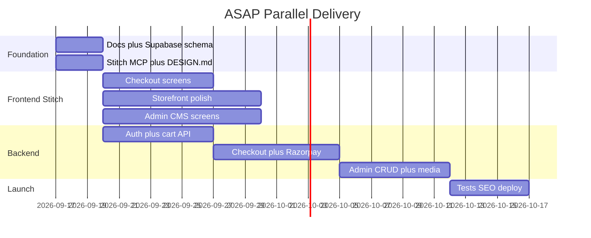

# Jai Jinendra — Roadmap

Living document. Update checkboxes as sprints complete. Source plan: E2E project plan (Sep 2026).

---

## Phase overview

| Sprint | Days | Theme | Status |
|--------|------|-------|--------|
| **Sprint 0** | 1–3 | Foundation — docs, Supabase, Stitch, auth | Largely done |
| **Sprint 1–3** | — | Cart, checkout, admin CMS | Largely done in code |
| **Hardening Phase 0–1** | — | Security + inventory + Zod | **Launch gate** — code done; apply migrations |
| **Hardening Phase 2–3** | — | Cache, rate limits, tests, Sentry | **Post-launch** — code scaffolded |

---

## Production hardening (audit roadmap)

### Phase 0 — Ship blockers (launch gate) ✅ code

- [x] Remove unauthenticated `/api/create-order`
- [x] Require `ADMIN_PASSWORD`; no hardcoded default
- [x] Move `promoteUserToAdmin` to `scripts/`
- [x] Migration: lock `profiles.role` (`004_lock_profiles_role.sql`)
- [x] `requireAdmin()` in admin dashboard layout
- [x] Validate login `next` redirect
- [x] `crypto.timingSafeEqual` for Razorpay HMAC

### Phase 1 — Integrity (launch gate) ✅ code

- [x] Atomic `decrement_stock` / `confirm_order_payment` (`005_atomic_inventory.sql`)
- [x] Cart clear by `user_id` on payment success
- [x] Zod schemas on mutating APIs + account/admin content
- [x] Experience pages → catalog queries; no mock when Supabase on
- [x] Stronger order numbers + indexes

### Phase 2 — Scale (post-launch) ✅ code

- [x] Cached product search index in root layout
- [x] `revalidateTag` from admin + catalogue `revalidate = 60`
- [x] SQL KPI RPC (`006_scale_ops.sql`)
- [x] Rate limits (memory / Upstash)
- [x] Security headers + CSP report-only
- [x] Webhook dedupe + Shiprocket token table + Resend retry

### Phase 3 — Ops (post-launch) ✅ scaffold

- [x] Vitest unit tests (`npm run test`)
- [x] Playwright smoke (`npm run test:e2e`)
- [x] GitHub Actions CI (`tsc` + lint + unit tests)
- [x] Sentry (`NEXT_PUBLIC_SENTRY_DSN` / `SENTRY_DSN`) + Vercel Analytics
- [x] Structured payment logs (no PII)

**Apply on Supabase before launch:** migrations `004`, `005`, `006`.

---

## Inventory: done vs remaining

### Done — static prototype

- [x] Next.js 16 storefront (home, catalogue, PDP, experience pages)
- [x] Promise / customer-care pages (purity, freshness, corporate, outlets, support)
- [x] Admin UI shell with mock data (`src/data/admin-mock.ts`)
- [x] Design tokens + brand assets
- [x] Catalog types (`src/types/catalog.ts`)
- [x] Partial SEO (metadata + JSON-LD on home/PDP)
- [x] Demo admin cookie gate (`middleware.ts`)

### Remaining — production

#### Commerce (critical path)

- [x] Real cart (API + client state)
- [x] Add to cart / Buy now on PDP + combo builder
- [x] Checkout route (`/checkout`)
- [x] Customer login/signup (phone OTP)
- [x] Razorpay integration + webhooks
- [x] Order creation + lifecycle
- [x] Order tracking (real API)
- [x] Pincode validation (pan-India)
- [ ] Shipping calculator (live zones — flat ₹79 until wired)

#### Backend / data

- [x] Supabase schema + RLS (apply remaining migrations)
- [x] API routes / server actions
- [x] Replace `src/data/*` in prod paths when Supabase on
- [x] `.env.example` + Vercel env vars
- [x] Resend email (retry)
- [x] Admin media upload (Supabase Storage)

#### Ops / quality

- [x] Unit tests (Vitest foundation)
- [x] CI pipeline
- [ ] Expand Playwright: login → cart → COD
- [ ] `sitemap.ts` / `robots.ts` audit
- [x] Monitoring baseline (Sentry / Vercel Analytics)
- [ ] Production deploy READY + webhook 2xx
---

## Sprint 0 — Foundation

**Goal:** Docs, database, design system, auth foundation.

### Docs track
- [x] `PROJECT.md`
- [x] `docs/ROADMAP.md`
- [x] `docs/DESIGN.md`
- [x] `docs/ARCHITECTURE.md`
- [x] `.env.example`
- [x] `CLAUDE.md` → references PROJECT.md

### Supabase track
- [ ] Create project
- [ ] Apply schema migrations (see ARCHITECTURE.md)
- [ ] RLS policies (customer vs admin)
- [ ] Seed from `src/data/catalogue.ts`, `home.ts`, `promise-pages.ts`
- [ ] `src/lib/supabase/*` client helpers

### Stitch track
- [ ] Connect Stitch MCP in Cursor
- [ ] Link project **Jai Jinendra Namkeens E-Commerce**
- [ ] Commit DESIGN.md as Stitch reference
- [ ] Export initial checkout screens

### Auth track
- [ ] Supabase Auth phone OTP for customers
- [ ] Admin role via `profiles.role`
- [ ] Replace demo cookie in `middleware.ts`

---

## Sprint 1 — Cart + Auth

**Goal:** Persistent cart, inventory checks, phone login.

- [ ] `/login` — phone OTP (Stitch Track A)
- [ ] `POST/GET /api/cart`
- [ ] Cart client store + header badge
- [ ] Wire Add to Cart on PDP + ComboBuilder
- [ ] Inventory check on add/update
- [ ] `/account` shell (profile stub)

---

## Sprint 2 — Checkout + Payments

**Goal:** End-to-end order placement.

- [ ] `/checkout` multi-step (address → review → pay)
- [ ] Address CRUD + pincode validation
- [ ] `POST /api/checkout/validate`
- [ ] `POST /api/orders/create`
- [ ] Razorpay create-order + webhook
- [ ] COD path
- [ ] Order confirmation page
- [ ] Resend transactional emails
- [ ] Track order API

---

## Sprint 3 — Admin CMS + Ops

**Goal:** Full admin persistence (Stitch Track C).

- [ ] Products / variants / inventory CRUD
- [ ] Orders list + detail + status updates
- [ ] Media library + upload
- [ ] Content blocks editor (home/promise)
- [ ] Enquiries inbox
- [ ] Outlets CRUD

---

## Sprint 4 — Hardening + Launch

**Goal:** Production-ready deploy.

- [ ] Remove all prod reads from `src/data/*`
- [ ] `sitemap.ts`, `robots.ts`, OG audit
- [ ] E2E: browse → login → cart → checkout → track
- [ ] Vercel production + env vars
- [ ] Error monitoring

---

## Parallel tracks

| Track | Priority | Screens / scope |
|-------|----------|-----------------|
| **A — Checkout** | P0 | Cart, OTP login, address, review/pay, confirmation, tracking |
| **B — Storefront** | P1 | Home refine, catalogue filters, PDP variants, account |
| **C — Admin CMS** | P1 | Products, orders, media, content, enquiries |

**Rule:** Backend API for a screen must exist before wiring that screen to Supabase.

---

## Risk register

| Risk | Mitigation |
|------|------------|
| Stitch MCP not connected | Manual export from labs.google/stitch; refs in `docs/stitch-refs/` |
| Phone OTP SMS delivery | Supabase Auth; test with Supabase test numbers first |
| Razorpay webhook on Vercel | Serverless route + signature verification |
| Inventory race at checkout | Postgres transaction: lock variant, check stock, decrement atomically |
| Timeline slip | P0 = checkout + backend Sprints 1–2; storefront polish is P1 |

---

## Definition of done (v1)

See checklist in [`PROJECT.md`](../PROJECT.md#definition-of-done-v1-launch).
